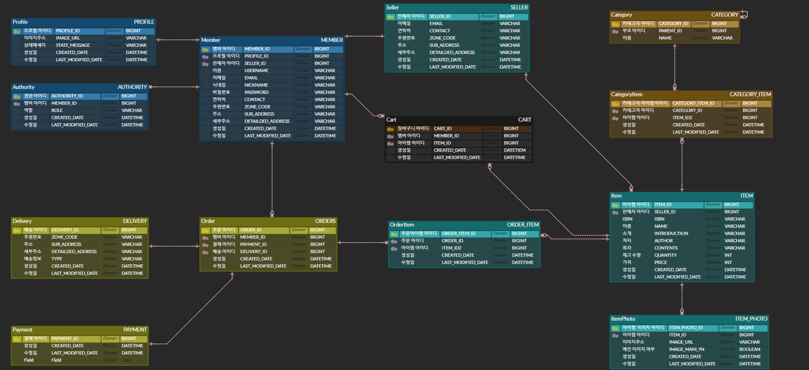

## 개인 - 북 스토어 토이 프로젝트

### ⚡프로젝트 소개

#### 시작하게 된 이유
> - JPA, JPQL, Spring Data JPA, QueryDSL 익숙해질 수 있게 연습
> - 테이블 설계 연습
> - 권한에 따른 사용자, 판매자, 관리자 연습 (Spring Security)
> - 질의 N + 1 문제 해결 연습 (join fetch(다대일), default_batch_fetch_size(일대다 페이징 처리))

### ⚙️ 기술 정보

### 🚧 요구사항 및 진행
#### 멤버 기능 (유저)
- [x] 회원가입
- [x] 로그인
- [x] 마이페이지
- [x] 프로필 & 멤버 수정
- [x] 닉네임, 주소 이름 수정
- [x] 프로필 상메 수정
- [x] 프로필 이미지 수정
- [ ] 프로필 이미지는 최대 1개 검증

#### 멤버 기능 (판매자)
- [x] 판매자 등록

#### 멤버 기능 (어드민)
- [x] 판매자 권한 등록 조회(페이징)
- [x] 판매자 권한 등록 세부 조회 
- [x] 권한 부여, 취소

#### 책 상품 기능 (판매자)
- [x] 상품, 이미지 등록
- [ ] 등록, 수정시 메인 이미지는 최대 1개 검증, 서브 이미지는 최대 5개 검증
- [X] 등록 상품 조회(페이징)
- [ ] 검색 조건 기능
- [X] 상품 수정 
- [ ] 상품 삭제 (모든 주문이 완료되어 있는 상태여야 한다)
- [ ] 삭제시 연관된 상품 이미지도 일괄 삭제 처리
- [X] 판매자 정보 수정
- [ ] 상품 등록 시 카테고리 설정

#### 책 상품 기능 (유저)
- [X] 상품 조회(페이징)
- [ ] 검색 조건 기능
- [X] 단일 상품 조회(detail)

#### 카테고리 기능 (어드민)
- [ ] 카테고리 등록
- [ ] 카테고리 수정
- [ ] 카테고리 삭제

#### 주문 기능 (유저)
- [ ] 주문 등록
- [ ] 주문 취소
- [ ] 주문 조회
- [ ] 주문 배달 조회

#### 배달 기능 (유저)
- [ ] 배달 등록
- [ ] 배달 취소

#### 장바구니 기능 (유저)
- [ ] 장바구니 등록(책)
- [ ] 장바구니 삭제
- [ ] 장바구니 수정
- [ ] 장바구니 조회

### 🔍 프로젝트 상세

#### ERD-Cloud

### 🌳 개발 환경

- Project: Gradle
- SpringBoot: 3.2.4
- Language: Java 17
- Dependencies
  - spring-boot-starter-data-jpa
  - querydsl-jpa:5.0.0:jakarta
  - p6spy-spring-boot-starter:1.9.0
  - thymeleaf-extras-springsecurity6
  - spring-boot-starter-security
  - spring-boot-starter-web
  - spring-boot-starter-validation
  - spring-boot-starter-thymeleaf
  - spring-boot-starter-test
  - lombok